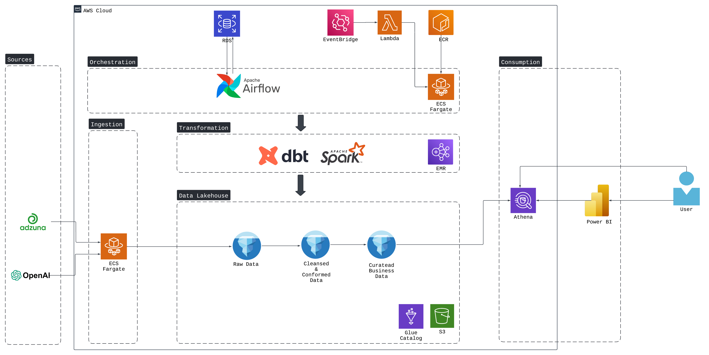
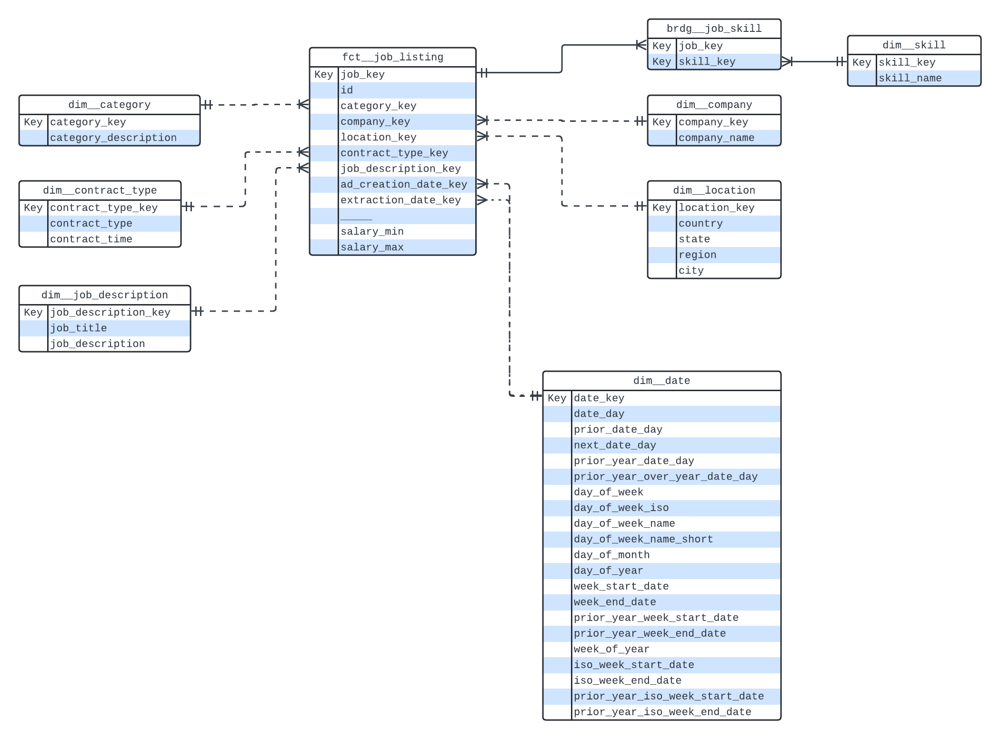
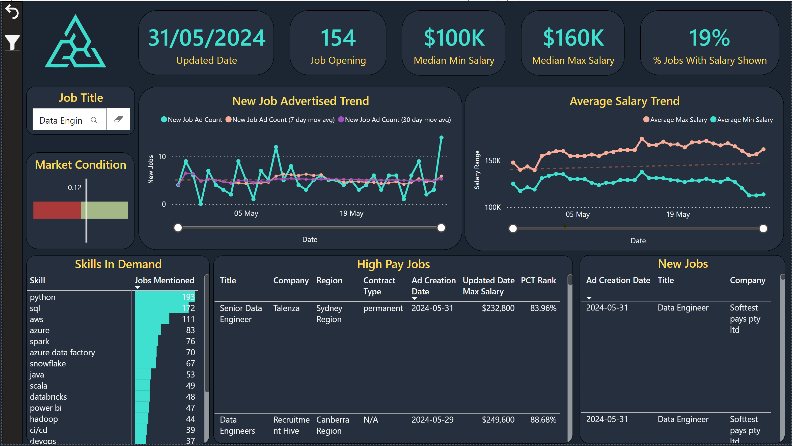
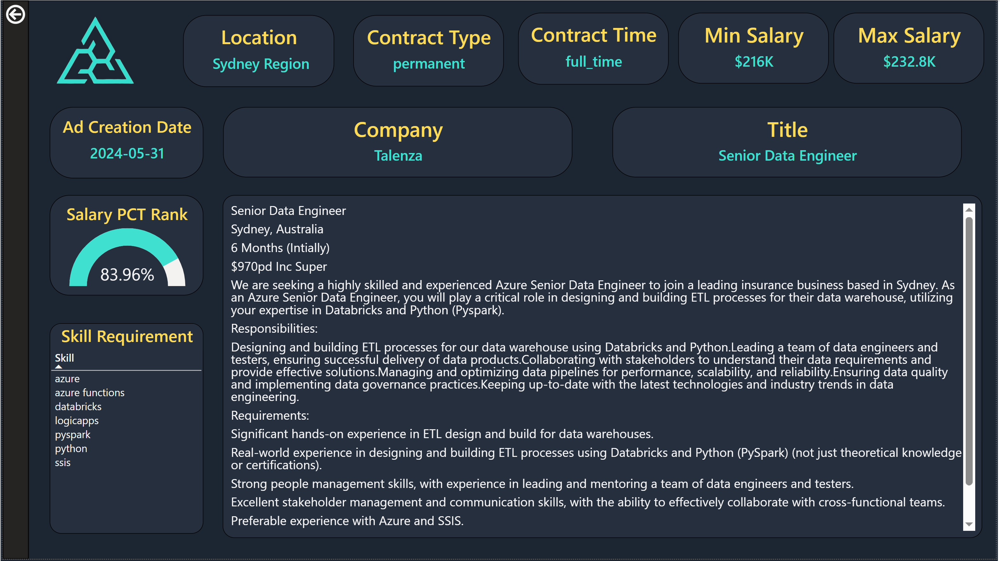

<a name="readme-top"></a>

<br />
<div align="center">

  <h1 align="center">Job Listing Data Curation</h1>

  <p align="center">
    <br />
</div>


<!-- TABLE OF CONTENTS -->
<details>
  <summary>Table of Contents</summary>
  <ol>
    <li>
      <a href="#about-the-project">About The Project</a>
      <ul>
        <li><a href="#built-with">Built With</a></li>
      </ul>
    </li>
    <li>
      <a href="#getting-started">Getting Started</a>
      <ul>
        <li><a href="#prerequisites">Prerequisites</a></li>
        <li><a href="#installation">Installation</a></li>
      </ul>
    </li>
    <li><a href="#usage">Usage</a></li>
    <li><a href="#license">License</a></li>
  </ol>
</details>


<!-- ABOUT THE PROJECT -->
## About The Project


Traditional job searching platforms often lack advanced filtering options, such as filtering jobs by date posted or searching jobs by specific skills. Moreover, crucial information is typically embedded within the job description as free text, making it challenging to conduct meaningful analytics.

The motivation behind this project stems from the need to empower job seekers with comprehensive and actionable insights into the job market. By overcoming the shortcomings of existing job searching platforms, we enable candidates to make more informed decisions about their career paths. This includes understanding current market conditions, gaining insights into salary ranges for specific roles, and identifying in-demand technologies to enhance their skill sets.

<p align="right">(<a href="#readme-top">back to top</a>)</p>


### Built With

* [![airflow-badge]][airflow-url]
* [![iceberg-badge]][iceberg-url]
* [![spark-badge]][spark-url]
* [![dbt-badge]][dbt-url]
* [![docker-badge]][docker-url]
* [![github-action-badge]][github-action-url]
* [![powerbi-badge]][powerbi-url]
* [![terraform-badge]][terraform-url]


### Architecture Diagram

### Data Model

### Power BI Report



<p align="right">(<a href="#readme-top">back to top</a>)</p>

<!-- GETTING STARTED -->
## Getting Started

### Prerequisites


- **Docker**
Install Docker Desktop: https://docs.docker.com/desktop/install/ubuntu/

- **Terraform**
Install Terraform : https://developer.hashicorp.com/terraform/tutorials/aws-get-started/install-cli

- **AWS CLI**
Install AWS CLI: https://docs.aws.amazon.com/cli/latest/userguide/getting-started-install.html

- **Adzuna API**
Create an account and obtain a free API key from Adzuna: https://developer.adzuna.com/

- **Open AI API**
Create an account and generate an API key from Open AI: https://platform.openai.com/

- **Slack Webhook URL**
Create an account and incoming webhook: https://api.slack.com/messaging/webhooks

### Local Installation

1. Create an .env file at the root directory of the project
```yaml
# .env
AIRFLOW_BASE_URL=http://localhost:8080
AWS_ACCESS_KEY_ID=<your_aws_access_key_id>
AWS_DEFAULT_REGION=<your_aws_region>
AWS_REGION=<your_aws_region>
AWS_SECRET_ACCESS_KEY=<your_aws_secret_access_key>
ENABLE_REMOTE_LOGGING=false
FERNET_KEY=<your_airflow_metastore_fernet_key>
POSTGRES_DB=airflow
POSTGRES_HOST=postgres
POSTGRES_PASSWORD=airflow
POSTGRES_PORT=5432
POSTGRES_USER=airflow
GLUE_CATALOG=<your_aws_glue_catalog>
GLUE_DATABASE=deafult
GLUE_DATABASE_STORAGE_LOCATION=<your_aws_s3_bucket>
STAGE=dev        
```

2. Start Docker container
```bash
docker compose up --build -d
```

3. Create admin user in Airflow
```bash
docker exec -it <airflow_webserver_container_id> /bin/bash

airflow users create -u admin -f <first_name> -l <last_name> -r Admin -e <email>
```

3. Configure connections in Airflow
```vash
airflow connections add 'adzuna_conn' \
    --conn-json '{
        "conn_type": "http",
        "extra": {
            "application_id": "<your_application_id>",
            "application_password": "<your_application_password>"
        }
    }'

airflow connections add 'aws_custom'  \
    --conn-json '{
        "conn_type": "aws",
        "login":"<your_aws_access_key_id>",
        "password":"<your_aws_secret_access_key>",
        "extra": {
            "region_name": "<your_aws_region>"
        }
    }'

airflow connections add 'openai_conn'  \
    --conn-json '{
        "conn_type": "http",
        "password":"<your_open_ai_api_key>"
    }'

airflow connections add 'slack_conn' \
    --conn-json '{
        "conn_type": "slack",
        "password":"<your_slack_webhook_url>"
    }'

```

<p align="right">(<a href="#readme-top">back to top</a>)</p>

## Deployment
### Cloud infrastructure set up
1. Configure variables in `terraform.tfvars` in Terraform project
2. Deploy resources to AWS
```bash
cd infra/terraform
terraform init
terraform apply
```
### CI/CD pipeline set up
1. Configure the necessary environment and variables listed in [.github/workflows/CICD.yml](.github/workflows/CICD.yml) in Github Actions.

<p align="right">(<a href="#readme-top">back to top</a>)</p>


<!-- USAGE EXAMPLES -->
## Usage

The Power BI report provides an easy way to interact with the data. More complex analysis can be conducted through AWS Athena. Some useful queries are provided below
```sql
-- Popularity of skills for jobs with salary > 50th percentile
WITH cte AS (
    SELECT
        job_key,
        job_description_key,
        company_key,
        salary_max,
        row_number() over (
            PARTITION by job_key
            ORDER BY
                extraction_date_day DESC
        ) AS row_num
    FROM
        fct__job_listing f
    WHERE
        salary_max > 0
),
salary_pct AS (
    SELECT
        c.job_key,
        jd.title,
        dc.company,
        c.salary_max,
        percent_rank() over (
            ORDER BY
                c.salary_max ASC
        ) AS pct_rank
    FROM
        cte c
        JOIN dim__job_description jd ON c.job_description_key = jd.job_description_key
        JOIN dim__company dc ON dc.company_key = c.company_key
    WHERE
        row_num = 1
        AND lower(title) LIKE '%data%engineer'
)
SELECT
    ds.skill,
    count(s.job_key) AS job_required_count
FROM
    salary_pct s
    JOIN brdg__job_skill b ON b.job_key = s.job_key
    JOIN dim__skill ds ON ds.skill_key = b.skill_key
WHERE
    s.pct_rank > 0.5
GROUP BY
    ds.skill
ORDER BY
    count(s.job_key) DESC
```
```sql
-- Re-advertised jobs
WITH cte AS (
    SELECT
        f.job_key,
        d.title,
        f.extraction_date_day,
        CASE
            WHEN date_diff(
                'day',
                lag(f.extraction_date_day) over (
                    PARTITION by f.job_key
                    ORDER BY
                        f.extraction_date_day ASC
                ),
                f.extraction_date_day
            ) = 1 THEN 0
            ELSE 1
        END AS segment_start
    FROM
        fct__job_listing f
        JOIN dim__job_description d ON f.job_description_key = d.job_description_key
        AND lower (d.title) LIKE '%data%engineer'

),
segment AS (
    SELECT
        job_key,
        title,
        extraction_date_day,
        sum(segment_start) over (
            PARTITION by job_key
            ORDER BY
                extraction_date_day ASC
        ) AS segment_no
    FROM
        cte
),
segment_summary AS (
    SELECT
        job_key,
        title,
        segment_no,
        min(extraction_date_day) AS start_ad_date,
        max(extraction_date_day) AS end_ad_date
    FROM
        segment
    GROUP BY
        job_key,
        title,
        segment_no
)
SELECT
    job_key,
    title,
    listagg(
        concat(
            'start: ',
            cast(start_ad_date AS varchar),
            ', end: ',
            cast(end_ad_date AS varchar)
        ),
        '\n'
    ) within group (
        ORDER BY
            end_ad_date DESC
    ) AS details
FROM
    segment_summary
GROUP BY
    job_key,
    title
HAVING
    count(*) > 1
    AND max(end_ad_date) = (
        SELECT
            max(extraction_date_day)
        FROM
            fct__job_listing
    )
```

<p align="right">(<a href="#readme-top">back to top</a>)</p>


<!-- LICENSE -->
## License

Distributed under the MIT License. See `LICENSE.txt` for more information.

<p align="right">(<a href="#readme-top">back to top</a>)</p>


<!-- MARKDOWN LINKS & IMAGES -->
[github-action-badge]:https://img.shields.io/badge/-github%20actions-1c2541?logo=githubactions&logoColor=2088FF&style=for-the-badge
[github-action-url]:https://github.com/features/actions
[spark-badge]: https://img.shields.io/badge/-apache%20spark-1c2541?logo=apachespark&logoColor=E25A1C&style=for-the-badge
[spark-url]: https://spark.apache.org/
[Airflow-badge]: https://img.shields.io/badge/-Apache%20Airflow-1c2541?logo=apacheairflow&logoColor=017CEE&style=for-the-badge
[airflow-url]: https://airflow.apache.org/
[dbt-badge]: https://img.shields.io/badge/-dbt-1c2541?logo=dbt&logoColor=FF694B&style=for-the-badge
[dbt-url]: https://www.getdbt.com/
[terraform-badge]: https://img.shields.io/badge/-terraform-1c2541?logo=terraform&logoColor=844FBA&style=for-the-badge
[terraform-url]: https://www.terraform.io/
[powerbi-badge]: https://img.shields.io/badge/-power%20bi-1c2541?logo=powerbi&logoColor=F2C811&style=for-the-badge
[powerbi-url]: https://www.microsoft.com/en-us/power-platform/products/power-bi
[docker-badge]: https://img.shields.io/badge/-docker-1c2541?logo=docker&logoColor=2496ED&style=for-the-badge
[docker-url]: https://www.docker.com/
[iceberg-badge]: https://img.shields.io/badge/-apache%20iceberg-1c2541.svg?logo=data:image/svg%2bxml;base64,PD94bWwgdmVyc2lvbj0iMS4wIiBlbmNvZGluZz0iVVRGLTgiPz4KPHN2ZyB2ZXJzaW9uPSIxLjEiIHhtbG5zPSJodHRwOi8vd3d3LnczLm9yZy8yMDAwL3N2ZyIgd2lkdGg9IjEwMCIgaGVpZ2h0PSIxMDAiPgo8cGF0aCBkPSJNMCAwIEMwLjYzMjkyOTY5IDAuNDkxMTMyODEgMS4yNjU4NTkzOCAwLjk4MjI2NTYzIDEuOTE3OTY4NzUgMS40ODgyODEyNSBDMi45NDkyMTg3NSAyLjIzMDc4MTI1IDMuOTgwNDY4NzUgMi45NzMyODEyNSA1LjA0Mjk2ODc1IDMuNzM4MjgxMjUgQzEzLjc4Mzk3MjAxIDEyLjA5OTI0MDg5IDE5LjMzOTM5MDk5IDIyLjkxMzk0ODU5IDIwLjE1NjI1IDM1LjAxOTUzMTI1IEMyMC40MDE5OTk4NyA0OC4xNjA2ODIxOSAxOC4xNDcwNzI2OCA1OC44ODMzMjA1NCA5LjkxNzk2ODc1IDY5LjQ4ODI4MTI1IEM5LjE3NTQ2ODc1IDcwLjUxOTUzMTI1IDguNDMyOTY4NzUgNzEuNTUwNzgxMjUgNy42Njc5Njg3NSA3Mi42MTMyODEyNSBDMC45MDk4Mjc3MSA3OS42Nzg2MTA1MSAtNi43NzU1Mjc5MiA4My43MjMwOTAxNyAtMTYuMDgyMDMxMjUgODYuNDg4MjgxMjUgQy0xNi45OTQ2ODc1IDg2Ljc3ODMyMDMxIC0xNi45OTQ2ODc1IDg2Ljc3ODMyMDMxIC0xNy45MjU3ODEyNSA4Ny4wNzQyMTg3NSBDLTMwLjg4MjE4MzY1IDg5LjU2MjIyMzU2IC00My4wMTUzMjczMiA4Ni43ODEwNTgwNSAtNTQuMzMyMDMxMjUgODAuMzY3MTg3NSBDLTYyLjU5ODM1NjU2IDc0LjcxOTMxNDY3IC02OS4xODI1OTc2NCA2Ny40MDI0MjI1OCAtNzIuNzA3MDMxMjUgNTguMDUwNzgxMjUgQy03My4zNDUxMTcxOSA1Ni4zODIwODk4NCAtNzMuMzQ1MTE3MTkgNTYuMzgyMDg5ODQgLTczLjk5NjA5Mzc1IDU0LjY3OTY4NzUgQy03OC40MzYwMjM4MiA0MS42MzE0MDM4MiAtNzYuMjQ3MDMzOCAyOC43NjQ4Nzc4NCAtNzAuNzA3MDMxMjUgMTYuNDI1NzgxMjUgQy02NC4yMjkyMjE0IDQuNzE1ODk0MiAtNTIuOTY1ODAzNTIgLTMuMzM4OTQyOTQgLTQwLjU4MjAzMTI1IC03Ljc2MTcxODc1IEMtMjYuNTIwNjMwMzMgLTEwLjgwMDUyODM4IC0xMS42NzI3NTcxNCAtOC41Njg1MjY2NCAwIDAgWiAiIGZpbGw9IiMyNzdBQkUiIHRyYW5zZm9ybT0idHJhbnNsYXRlKDc4LjA4MjAzMTI1LDEwLjUxMTcxODc1KSIvPgo8cGF0aCBkPSJNMCAwIEMwLjg0NDk4MDQ3IDAuNjE4NzUgMC44NDQ5ODA0NyAwLjYxODc1IDEuNzA3MDMxMjUgMS4yNSBDNS42OTg2MzM0MyA0LjMyMjAxNzg4IDguMjcyMjc3MzEgNy44MjgxODg4MyAxMSAxMiBDMTEgMTIuMzMgMTEgMTIuNjYgMTEgMTMgQzMuNDEgMTMgLTQuMTggMTMgLTEyIDEzIEMtMTIgMTguMjggLTEyIDIzLjU2IC0xMiAyOSBDLTE1LjM3MjE4NzUgMzAuNzMyNSAtMTUuMzcyMTg3NSAzMC43MzI1IC0xOC44MTI1IDMyLjUgQy0xOS41MTYwODY0MyAzMi44NjU0NDkyMiAtMjAuMjE5NjcyODUgMzMuMjMwODk4NDQgLTIwLjk0NDU4MDA4IDMzLjYwNzQyMTg4IEMtMjMuODI1MzI0OSAzNS4wNjcwMzIzNSAtMjUuNzI5MTI3MjMgMzYgLTI5IDM2IEMtMjUuODI4MTQ3MSA0MS45Mjk1MTE5NSAtMjIuNjY4NzczOTcgNDcuNzQ3MjcxMTEgLTE4Ljc4NTE1NjI1IDUzLjI0NjA5Mzc1IEMtMTggNTUgLTE4IDU1IC0xOC4wODU5Mzc1IDU3LjExMzI4MTI1IEMtMTkgNTkgLTE5IDU5IC0yMS4wNjY0MDYyNSA2MC4wNDY4NzUgQy0yMy4zNzc2MDQxNyA2MC42OTc5MTY2NyAtMjUuNjg4ODAyMDggNjEuMzQ4OTU4MzMgLTI4IDYyIEMtMjguMzMgNjYuMjkgLTI4LjY2IDcwLjU4IC0yOSA3NSBDLTMwLjYzMjAzNDEzIDczLjY0NTc1ODkxIC0zMi4yNTU4MjU5NyA3Mi4yODA3MDMyNCAtMzMuODQzNzUgNzAuODc1IEMtMzUuMzQxNDUzOTggNjkuNTcyNjQ4NzEgLTM2Ljg4ODE4MDkyIDY4LjMyNTQzMjIxIC0zOC40Njg3NSA2Ny4xMjUgQy00MS4xNjU0NzUxNSA2NC44NzIwMzk3NSAtNDMuMTM1NDQ5NzIgNjIuOTkxNzU1NjcgLTQ1IDYwIEMtNDUuMjE4NzUgNTYuMzY3MTg3NSAtNDUuMjE4NzUgNTYuMzY3MTg3NSAtNDQuOTM3NSA1Mi40Mzc1IEMtNDQuNDAxMzAyNjMgNDcuMDY2NjI0NzcgLTQ0LjQwMTMwMjYzIDQ3LjA2NjYyNDc3IC00Ny4wMTU2MjUgNDIuNjc5Njg3NSBDLTQ4LjgwMTc5NTI3IDQxLjQzMTQ1NzQgLTUwLjYwOTczNDkzIDQwLjIxMzgzMzI5IC01Mi40Mzc1IDM5LjAyNzM0Mzc1IEMtNTYuODg1OTY1OTcgMzUuNTA3OTAxOTMgLTU4LjgwMDQyNDUyIDMwLjQ1MjYxNTg0IC02MCAyNSBDLTU5LjY2OTU0MzQ3IDIwLjAzNjY3MjU2IC01OC4zNTE5NDY0OCAxNy43MDM4OTI5NiAtNTYgMTMgQy02MC42MiAxMyAtNjUuMjQgMTMgLTcwIDEzIEMtNjUuNjUzOTI2IDIuMTM0ODE0OTkgLTU2LjMzNzEyOTk1IC0zLjMzNTAzODc5IC00NiAtOCBDLTMxLjA5NzA1MzcyIC0xNC4zNzA3MjUxMyAtMTIuMjEwMzg0MzQgLTkuNTEwNzI1MzMgMCAwIFogIiBmaWxsPSIjQjJERUYyIiB0cmFuc2Zvcm09InRyYW5zbGF0ZSg4MCwxMikiLz4KPHBhdGggZD0iTTAgMCBDMC44NDQ5ODA0NyAwLjYxODc1IDAuODQ0OTgwNDcgMC42MTg3NSAxLjcwNzAzMTI1IDEuMjUgQzUuNjk4NjMzNDMgNC4zMjIwMTc4OCA4LjI3MjI3NzMxIDcuODI4MTg4ODMgMTEgMTIgQzExIDEyLjMzIDExIDEyLjY2IDExIDEzIEMtMTUuNzMgMTMgLTQyLjQ2IDEzIC03MCAxMyBDLTY1LjY1MzkyNiAyLjEzNDgxNDk5IC01Ni4zMzcxMjk5NSAtMy4zMzUwMzg3OSAtNDYgLTggQy0zMS4wOTcwNTM3MiAtMTQuMzcwNzI1MTMgLTEyLjIxMDM4NDM0IC05LjUxMDcyNTMzIDAgMCBaICIgZmlsbD0iI0I3RTBGMiIgdHJhbnNmb3JtPSJ0cmFuc2xhdGUoODAsMTIpIi8+CjxwYXRoIGQ9Ik0wIDAgQzUuOTQgMCAxMS44OCAwIDE4IDAgQzE4IDUuMjggMTggMTAuNTYgMTggMTYgQzE0LjYyNzgxMjUgMTcuNzMyNSAxNC42Mjc4MTI1IDE3LjczMjUgMTEuMTg3NSAxOS41IEMxMC40ODM5MTM1NyAxOS44NjU0NDkyMiA5Ljc4MDMyNzE1IDIwLjIzMDg5ODQ0IDkuMDU1NDE5OTIgMjAuNjA3NDIxODggQzYuMTc0Njc1MSAyMi4wNjcwMzIzNSA0LjI3MDg3Mjc3IDIzIDEgMjMgQzQuMTcxODUyOSAyOC45Mjk1MTE5NSA3LjMzMTIyNjAzIDM0Ljc0NzI3MTExIDExLjIxNDg0Mzc1IDQwLjI0NjA5Mzc1IEMxMiA0MiAxMiA0MiAxMS45MTQwNjI1IDQ0LjExMzI4MTI1IEMxMSA0NiAxMSA0NiA4LjkzMzU5Mzc1IDQ3LjA0Njg3NSBDNi42MjIzOTU4MyA0Ny42OTc5MTY2NyA0LjMxMTE5NzkyIDQ4LjM0ODk1ODMzIDIgNDkgQzEuNjcgNTMuMjkgMS4zNCA1Ny41OCAxIDYyIEMtMSA2MCAtMSA2MCAtMS4yMDI1NDUxNyA1Ny40ODE2NTg5NCBDLTEuMTgwMzM5MDUgNTYuNDIwMjA2NiAtMS4xNTgxMzI5MyA1NS4zNTg3NTQyNyAtMS4xMzUyNTM5MSA1NC4yNjUxMzY3MiBDLTEuMTE1MDgyMDkgNTMuMDY0MDQyNjYgLTEuMDk0OTEwMjggNTEuODYyOTQ4NjEgLTEuMDc0MTI3MiA1MC42MjU0NTc3NiBDLTEuMDQxOTMwODUgNDkuMzIzMzUzNTggLTEuMDA5NzM0NSA0OC4wMjEyNDkzOSAtMC45NzY1NjI1IDQ2LjY3OTY4NzUgQy0wLjk1MDM5ODMyIDQ1LjMzNzM0ODEgLTAuOTI1MTMxMDcgNDMuOTk0OTkwOTUgLTAuOTAwNzI2MzIgNDIuNjUyNjE4NDEgQy0wLjgzNDA0NTk2IDM5LjExNzgzMzkzIC0wLjc1NTE2MDE3IDM1LjU4MzQyMjQzIC0wLjY3Mzc2NzA5IDMyLjA0ODk1MDIgQy0wLjU5Mjg3NTI0IDI4LjQ0MjkzNTQ2IC0wLjUyMzQ3NzY1IDI0LjgzNjcwMTc4IC0wLjQ1MzEyNSAyMS4yMzA0Njg3NSBDLTAuMzEzMzU5NyAxNC4xNTMzODE4NiAtMC4xNTk2NDMxMiA3LjA3NjY3MDQ0IDAgMCBaICIgZmlsbD0iIzZCQzJFQSIgdHJhbnNmb3JtPSJ0cmFuc2xhdGUoNTAsMjUpIi8+CjxwYXRoIGQ9Ik0wIDAgQzguNTggMCAxNy4xNiAwIDI2IDAgQzI2IDcuOTIgMjYgMTUuODQgMjYgMjQgQzE1Ljg3Njg0OTg2IDE5Ljg4NDg5ODMyIDUuODcyNjc5NDMgMTUuNjg3Mzc2NDkgLTQgMTEgQy0zLjM0NzY0MjI1IDYuNTYzOTY3MzEgLTIuMTU1NDQxMDkgNC4zMTA4ODIxOCAwIDAgWiAiIGZpbGw9IiNCNkUwRjMiIHRyYW5zZm9ybT0idHJhbnNsYXRlKDI0LDI1KSIvPgo8cGF0aCBkPSJNMCAwIEMwLjgyNDA1ODM4IC0wLjAwMDQ5ODUgMS42NDgxMTY3NiAtMC4wMDA5OTcwMSAyLjQ5NzE0NjYxIC0wLjAwMTUxMDYyIEM0LjIyNzUzMzI2IDAuMDAwODE2ODkgNS45NTc5MjQxNCAwLjAxMDQ2NjY5IDcuNjg4MjMyNDIgMC4wMjcwOTk2MSBDMTAuMzM0Nzc5OTEgMC4wNTA4MDU4NyAxMi45ODAzMjU1NiAwLjA0NzYzNjQ5IDE1LjYyNjk1MzEyIDAuMDQxMDE1NjIgQzE3LjMxMzgwODA4IDAuMDQ2NTg5NjEgMTkuMDAwNjU4ODEgMC4wNTM2OTc3MiAyMC42ODc1IDAuMDYyNSBDMjEuNDc2MDk5MDkgMC4wNjE1ODg1OSAyMi4yNjQ2OTgxOCAwLjA2MDY3NzE5IDIzLjA3NzE5NDIxIDAuMDU5NzM4MTYgQzI2Ljg5OTI2Mzc1IDAuMTA5MTExMjIgMjkuOTA1MzYzMDQgMC4yMDMyOTgzNCAzMy4xNDQ1MzEyNSAyLjM2MzI4MTI1IEMzMy4xNDQ1MzEyNSAzLjAyMzI4MTI1IDMzLjE0NDUzMTI1IDMuNjgzMjgxMjUgMzMuMTQ0NTMxMjUgNC4zNjMyODEyNSBDMzAuODM0NTMxMjUgNC4zNjMyODEyNSAyOC41MjQ1MzEyNSA0LjM2MzI4MTI1IDI2LjE0NDUzMTI1IDQuMzYzMjgxMjUgQzI2LjE0NDUzMTI1IDUuMzUzMjgxMjUgMjYuMTQ0NTMxMjUgNi4zNDMyODEyNSAyNi4xNDQ1MzEyNSA3LjM2MzI4MTI1IEMxMS45NTQ1MzEyNSA3LjM2MzI4MTI1IC0yLjIzNTQ2ODc1IDcuMzYzMjgxMjUgLTE2Ljg1NTQ2ODc1IDcuMzYzMjgxMjUgQy0xNi41MjU0Njg3NSA2LjA0MzI4MTI1IC0xNi4xOTU0Njg3NSA0LjcyMzI4MTI1IC0xNS44NTU0Njg3NSAzLjM2MzI4MTI1IEMtMTAuNTU3MjEzMTYgMC4zMjE4ODkwOSAtNi4wMTYxOTU3MSAtMC4wNzA4MDYxIDAgMCBaICIgZmlsbD0iI0VFRjhGRCIgdHJhbnNmb3JtPSJ0cmFuc2xhdGUoNDEuODU1NDY4NzUsMTcuNjM2NzE4NzUpIi8+CjxwYXRoIGQ9Ik0wIDAgQzYuNzE1MTAwODkgMi4wODE1NTgyOSAxMy4wOTcwOTEyNiA0LjY2Nzk2OTcyIDE5LjUgNy41NjI1IEMyMC44NTczODI4MSA4LjE2MDk0NzI3IDIwLjg1NzM4MjgxIDguMTYwOTQ3MjcgMjIuMjQyMTg3NSA4Ljc3MTQ4NDM4IEMyMy4xMDA3MDMxMiA5LjE1NzU1ODU5IDIzLjk1OTIxODc1IDkuNTQzNjMyODEgMjQuODQzNzUgOS45NDE0MDYyNSBDMjYuMDA2ODA2NjQgMTAuNDYyNjMwNjIgMjYuMDA2ODA2NjQgMTAuNDYyNjMwNjIgMjcuMTkzMzU5MzggMTAuOTk0Mzg0NzcgQzI5IDEyIDI5IDEyIDMwIDE0IEMyOC4yMTE5MDMwMyAxNS4xNzIxMzA0NSAyNi40MTk0MDg3NSAxNi4zMzc1NTUyNiAyNC42MjUgMTcuNSBDMjMuNjI3MjY1NjIgMTguMTQ5Njg3NSAyMi42Mjk1MzEyNSAxOC43OTkzNzUgMjEuNjAxNTYyNSAxOS40Njg3NSBDMTkgMjEgMTkgMjEgMTcgMjEgQzE3IDIyLjY1IDE3IDI0LjMgMTcgMjYgQzE2LjY3IDI2IDE2LjM0IDI2IDE2IDI2IEMxNS45MzI5Njg3NSAyNS4yNDcxODc1IDE1Ljg2NTkzNzUgMjQuNDk0Mzc1IDE1Ljc5Njg3NSAyMy43MTg3NSBDMTQuNzU1MDEyODMgMjAuMTY0MTYxNDIgMTMuMzE2NjA3MjggMTkuNDk2MDE2NTcgMTAuMjUgMTcuNSBDNC4wMDg4OTE1NSAxMi44NTA0NjM2MiAyLjExNDY0MDg0IDcuMzAxMDc1NzMgMCAwIFogIiBmaWxsPSIjOTBEM0YwIiB0cmFuc2Zvcm09InRyYW5zbGF0ZSgyMCwzNikiLz4KPHBhdGggZD0iTTAgMCBDNi4yNyAwIDEyLjU0IDAgMTkgMCBDMTkuODQzNTUxOCAxMy42MTczMzYxNSAxOS44NDM1NTE4IDEzLjYxNzMzNjE1IDE3LjQ0MTQwNjI1IDE3LjU1NDY4NzUgQzE1LjcwODM3MDQzIDE5LjIzNTQxODQyIDE0LjAxNzEwMjIyIDIwLjY3NzU2MzA5IDEyIDIyIEM5LjEwODgwNTE1IDE4LjM0MTU2MjUgNi43MjA4NTc2MSAxNC40MjA3MDA3MSA0LjMxMjUgMTAuNDM3NSBDMy44OTY3NzczNCA5Ljc2NTI1MzkxIDMuNDgxMDU0NjkgOS4wOTMwMDc4MSAzLjA1MjczNDM4IDguNDAwMzkwNjIgQzAgMy4zNTI2MDE2IDAgMy4zNTI2MDE2IDAgMCBaICIgZmlsbD0iIzREOEJDOCIgdHJhbnNmb3JtPSJ0cmFuc2xhdGUoNTEsNDgpIi8+CjxwYXRoIGQ9Ik0wIDAgQzMuMDIxNzE0MSAzLjcyOTM1MzI0IDUuNzQwOTQxNTIgNy41MDUzNjExMiA4LjMxMjUgMTEuNTYyNSBDOC44NzAzNDE4IDEyLjQwODQ0NzI3IDguODcwMzQxOCAxMi40MDg0NDcyNyA5LjQzOTQ1MzEyIDEzLjI3MTQ4NDM4IEMxMC45Mzk2NzcyNSAxNS42NjAxMDkzOCAxMS45OTYxMzY4MSAxNy40MzMwNzY3MiAxMi4wMTU2MjUgMjAuMjkyOTY4NzUgQzkuOTcwOTUxMjIgMjMuNzI5NTkzNTIgNS42MzE1MDc0NiAyMy45NzcwNDAxNSAyIDI1IEMxLjY3IDI5LjI5IDEuMzQgMzMuNTggMSAzOCBDLTEgMzYgLTEgMzYgLTEuMTM1MjUzOTEgMzIuNDY4MjYxNzIgQy0xLjA5Mjg5NDgzIDMwLjk1NTA3MTkyIC0xLjAzOTIyNDE5IDI5LjQ0MjE3MjYgLTAuOTc2NTYyNSAyNy45Mjk2ODc1IEMtMC45NTE1MzY1NiAyNy4xMzM0NTk3OCAtMC45MjY1MTA2MiAyNi4zMzcyMzIwNiAtMC45MDA3MjYzMiAyNS41MTY4NzYyMiBDLTAuODE4NDMzMDIgMjIuOTY5MTU2OTYgLTAuNzIxODgwOTcgMjAuNDIyMjAyMjYgLTAuNjI1IDE3Ljg3NSBDLTAuNTY2NzY5ODggMTYuMTQ5NzcxIC0wLjUwOTQ2NjQgMTQuNDI0NTEwNDYgLTAuNDUzMTI1IDEyLjY5OTIxODc1IEMtMC4zMTI4NDA2IDguNDY1NzA0NjMgLTAuMTU5NzY0ODcgNC4yMzI4MjE5MyAwIDAgWiAiIGZpbGw9IiM1OUFBREIiIHRyYW5zZm9ybT0idHJhbnNsYXRlKDUwLDQ5KSIvPgo8cGF0aCBkPSJNMCAwIEM3LjI2IDAgMTQuNTIgMCAyMiAwIEMyMiAwLjMzIDIyIDAuNjYgMjIgMSBDMTguMDQgMSAxNC4wOCAxIDEwIDEgQzEwLjQ5NSAxLjkyODEyNSAxMC45OSAyLjg1NjI1IDExLjUgMy44MTI1IEMxMyA3IDEzIDcgMTMgMTAgQzYuNTY1IDEyLjk3IDYuNTY1IDEyLjk3IDAgMTYgQzAgMTAuNzIgMCA1LjQ0IDAgMCBaICIgZmlsbD0iIzRFOENDOSIgdHJhbnNmb3JtPSJ0cmFuc2xhdGUoNjgsMjUpIi8+CjxwYXRoIGQ9Ik0wIDAgQy0zLjQzNjkxNTEzIDQuODEzNDU3MzcgLTYuNTU5ODc1MDcgOS4xODM3NTA5MSAtMTIuMzE2NDA2MjUgMTEuMTA5Mzc1IEMtMTcuMjMxMDY1MjUgMTEuODQ3NDEyNTMgLTIyLjAzNTk2ODYxIDEyLjA1NTE1NTkgLTI3IDEyIEMtMjMuMzI1MzUzODYgNy44OTIxNjM4NyAtMTguNDAyMjY1ODkgNi4wNzMxNjIxNSAtMTMuNSAzLjc1IEMtMTIuNTM3MDcwMzEgMy4yNzgyMDMxMiAtMTEuNTc0MTQwNjIgMi44MDY0MDYyNSAtMTAuNTgyMDMxMjUgMi4zMjAzMTI1IEMtOS42NTc3NzM0NCAxLjg3OTQ1MzEyIC04LjczMzUxNTYyIDEuNDM4NTkzNzUgLTcuNzgxMjUgMC45ODQzNzUgQy02LjkzNjI2OTUzIDAuNTc5Mjg3MTEgLTYuMDkxMjg5MDYgMC4xNzQxOTkyMiAtNS4yMjA3MDMxMiAtMC4yNDMxNjQwNiBDLTMgLTEgLTMgLTEgMCAwIFogIiBmaWxsPSIjMjc3MUFCIiB0cmFuc2Zvcm09InRyYW5zbGF0ZSg4MCwzNykiLz4KPHBhdGggZD0iTTAgMCBDNC45NSAwLjk5IDkuOSAxLjk4IDE1IDMgQzE1IDYuNjMgMTUgMTAuMjYgMTUgMTQgQzEwLjk1OTk0MTY1IDExLjk3OTk3MDgzIDguMzQ1NTgwNjggOS42MTAyNjcwNyA1LjI1IDYuNDM3NSBDNC43NDMzOTg0NCA1LjkzMDI1MzkxIDQuMjM2Nzk2ODcgNS40MjMwMDc4MSAzLjcxNDg0Mzc1IDQuOTAwMzkwNjIgQzAgMS4xNDA0ODgxMiAwIDEuMTQwNDg4MTIgMCAwIFogIiBmaWxsPSIjOEREMUVFIiB0cmFuc2Zvcm09InRyYW5zbGF0ZSgzNSw3MSkiLz4KPHBhdGggZD0iTTAgMCBDLTcuMjk4NDA1NDcgMTAuNTU4MDg2NTYgLTcuMjk4NDA1NDcgMTAuNTU4MDg2NTYgLTExIDE1IEMtMTIgMTQgLTEyIDE0IC0xMi4wOTc2NTYyNSAxMS40OTYwOTM3NSBDLTEyLjA4NjA1NDY5IDEwLjQ4Njc1NzgxIC0xMi4wNzQ0NTMxMiA5LjQ3NzQyMTg4IC0xMi4wNjI1IDguNDM3NSBDLTEyLjA1MzQ3NjU2IDcuNDI1NTg1OTQgLTEyLjA0NDQ1MzEyIDYuNDEzNjcxODggLTEyLjAzNTE1NjI1IDUuMzcxMDkzNzUgQy0xMi4wMjM1NTQ2OSA0LjU4ODYzMjgxIC0xMi4wMTE5NTMxMiAzLjgwNjE3MTg4IC0xMiAzIEMtMTAuMzc4OTg5NyAyLjMwMzE0NTAyIC04Ljc1MzAzOTM0IDEuNjE3NzcxMzkgLTcuMTI1IDAuOTM3NSBDLTYuMjIwMDc4MTMgMC41NTQ2NDg0NCAtNS4zMTUxNTYyNSAwLjE3MTc5Njg3IC00LjM4MjgxMjUgLTAuMjIyNjU2MjUgQy0yIC0xIC0yIC0xIDAgMCBaICIgZmlsbD0iIzI1NzBBOSIgdHJhbnNmb3JtPSJ0cmFuc2xhdGUoNjMsNzEpIi8+CjxwYXRoIGQ9Ik0wIDAgQzQuOTUgMC4zMyA5LjkgMC42NiAxNSAxIEMxMS41OTUwMTcxNSAzLjI2OTk4ODU3IDguMDE4NTA1NTQgNC45MjI1MjEyNyA0LjMxMjUgNi42MjUgQzMuNjEwNjA1NDcgNi45NDk4NDM3NSAyLjkwODcxMDk0IDcuMjc0Njg3NSAyLjE4NTU0Njg4IDcuNjA5Mzc1IEMwLjQ1ODA2MjYyIDguNDA4NDgzMzYgLTEuMjcwODMyNTQgOS4yMDQ1NDA0MyAtMyAxMCBDLTMuMzMgOS4zNCAtMy42NiA4LjY4IC00IDggQy0yLjg4NTM2MDc2IDUuMjEwNjAxMjkgLTEuNDEzNzE0NjYgMi42NTYwNjk5NiAwIDAgWiAiIGZpbGw9IiM4RkQzRUYiIHRyYW5zZm9ybT0idHJhbnNsYXRlKDI0LDI1KSIvPgo8cGF0aCBkPSJNMCAwIEMwLjY2IDEuMzIgMS4zMiAyLjY0IDIgNCBDLTAuOTcgNCAtMy45NCA0IC03IDQgQy03IDMuMDEgLTcgMi4wMiAtNyAxIEMtMy41MzUgMC41MDUgLTMuNTM1IDAuNTA1IDAgMCBaICIgZmlsbD0iI0M1RTVGNiIgdHJhbnNmb3JtPSJ0cmFuc2xhdGUoNzUsMjEpIi8+Cjwvc3ZnPgo=&style=for-the-badge
[iceberg-url]: https://iceberg.apache.org/
